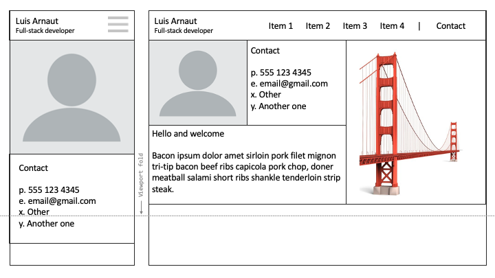

# 02 Advanced CSS Challenge

* [Description](#Description)
* [User Story](#User-Story)

## Description
Professional portfolio to showcase my full-stack projects. Scropp down for user stor, wireframes, and acceptance criteria.

## User Story
```
AS AN employer
I WANT to view a potential employee's deployed portfolio of work samples
SO THAT I can review samples of their work and assess whether they're a good candidate for an open position
```

## Wireframes

### Mobile Vs Desktop layout


### Portfolio grid demo 


## Responsive Functionality

- Design is responsive and adapts to various devices and screen resolutions. 
- Top navigation adapts to various viewports:
  - _Hamburger menu_ is displayed on smaller resolutions (under 1024px)
    - Menu items on mobile devices occupy the full viewport width and display in a top-down fashion.
  - _Regular menu_ is displayed on larger resolutions (over 1024px)
    - Menu items adjust and space evenly when screen is resized
  

### Responsive Layout Breakpoints
Layout is responsive and adapts to a variety of view ports:
> XX-Small: Minimum viewport freezes at 375 px

> X-Small: Viewport between 375px to 414px. Best for:
> - iPhone 6/6S/6Plus, iPhone 7/7Plus, iPhone 8/8Plus
> - iPhone X/XS/XSMax/XR
> - Google Pixel (All versions) 
> - Nexus 5X/6P 
> - Galaxy Note 5/10/10+ 
> - Samsung S7, S8, S9, S20 (including Edge and Plus versions)

> Small: Viewport between 415px and 599px. Best for: 
> - Large Android smartphones and iPhones in landscape mode:
>   - Galaxy Note 5, 9, 10 (including Plus versions)
>   - Samsung S7, S8, S9, S20 (including Edge and Plus versions) 
>   - iPhone X/XS/XSMax/XR

> Medium: Viewport between 600px and 767px. Best for:
> - iPad Air, iPad Mini
> - Android tablets (multiple size)

> Large: Viewport between 768px and 1023px (newer Android tablets and iPads):
> - iPad Air, iPad Mini (in landscape mode)
> - Pixel C, Samsung Galaxy Tablets

> X-large: Viewport between 1024px and 1199px. Best for:
> - Desktop resolutions up to 1199px.
> - iPad Pro

> XX-large: Viewport larger than 1200px


## Acceptance Criteria
```
GIVEN I need to sample a potential employee's previous work
WHEN I load their portfolio
THEN I am presented with the developer's name, a recent photo, and links to sections about them, their work, and how to contact them
WHEN I click one of the links in the navigation
THEN the UI scrolls to the corresponding section
WHEN I click on the link to the section about their work
THEN the UI scrolls to a section with titled images of the developer's applications
WHEN I am presented with the developer's first application
THEN that application's image should be larger in size than the others
WHEN I click on the images of the applications
THEN I am taken to that deployed application
WHEN I resize the page or view the site on various screens and devices
THEN I am presented with a responsive layout that adapts to my viewport
```